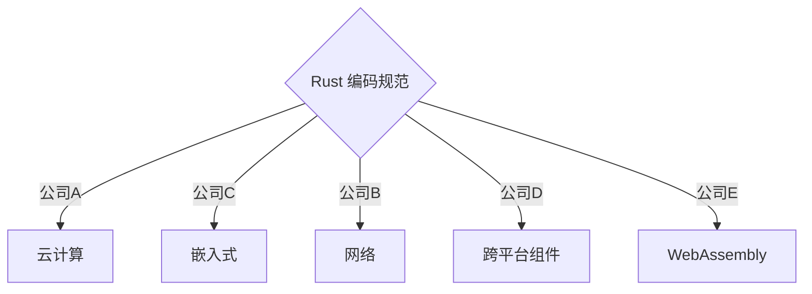

# rust-coding-guidelines-zh
Rust 编码规范 中文版

据了解，Rust 社区内有些公司和组织都各自维护着自己的编码规范。下面罗列了一些已经公开的：

- [法国国家信息安全局 | Rust 安全（Security）规范](https://anssi-fr.github.io/rust-guide)
- [Facebook Diem 项目 Rust 编码规范](https://developers.diem.com/docs/core/coding-guidelines/)
- [Apache Teaclave 安全计算平台 | Rust 开发规范](https://teaclave.apache.org/docs/rust-guildeline/)
- [PingCAP | 编码风格指南（包括 Rust 和 Go 等）](https://github.com/pingcap/style-guide)
- [Google Fuchsia 操作系统 Rust 开发指南](https://fuchsia.dev/fuchsia-src/development/languages/rust)

但是随着 Rust 日益普及，统一的编码规范需求也逐渐浮出水面，本规范应运而生。

本规范致力于成为统一的 Rust 编码规范，并联合国内外公司共同维护。

公司可以依赖本规范，结合自己的业务领域和团队习惯，形成自己的编码规范，并可以在日常实践中反哺本规范，让本规范更加完善。

如何参与贡献？

请阅读 [贡献说明](./src/contribution.md) 。

