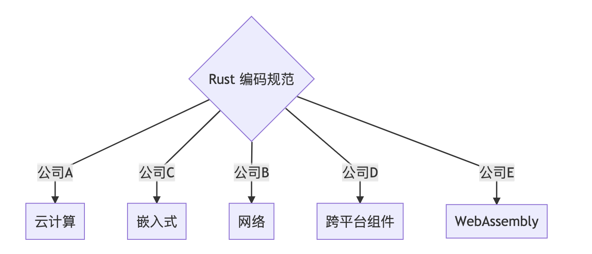

# Rust 编码规范 中文版

## 状态

- 《Rust 安全编码规范》初稿发布 2021-10-31 (V 0.1)
- 《Rust 安全编码规范》经社区和公司内第一次评审版本发布 2022-02- (V 0.2) ，改进内容参考 [Changelog](./Changelog.md)。

## 介绍

据了解，Rust 社区内有些公司和组织都各自维护着自己的编码规范。下面罗列了一些已经公开的：

- [官方｜Rust API 编写指南](https://rust-lang.github.io/api-guidelines/about.html)
- [官方 | Rust Style Guide](https://github.com/rust-dev-tools/fmt-rfcs/blob/master/guide/guide.md)
- [Rust's Unsafe Code Guidelines Reference](https://rust-lang.github.io/unsafe-code-guidelines/)
- [法国国家信息安全局 | Rust 安全（Security）规范](https://anssi-fr.github.io/rust-guide)
- [Facebook Diem 项目 Rust 编码规范](https://developers.diem.com/docs/core/coding-guidelines/)
- [Apache Teaclave 安全计算平台 | Rust 开发规范](https://teaclave.apache.org/docs/rust-guildeline/)
- [PingCAP | 编码风格指南（包括 Rust 和 Go 等）](https://github.com/pingcap/style-guide)
- [Google Fuchsia 操作系统 Rust 开发指南](https://fuchsia.dev/fuchsia-src/development/languages/rust)
- [RustAnalyzer 编码风格指南](https://github.com/rust-analyzer/rust-analyzer/blob/master/docs/dev/style.md)
- [使用 Rust 设计优雅的 API](https://deterministic.space/elegant-apis-in-rust.html)
- [Rust FFI 指南](https://michael-f-bryan.github.io/rust-ffi-guide/)
- [大约 478 条 Clippy lint](https://rust-lang.github.io/rust-clippy/master/index.html)
- [lints in the rustc book ](https://doc.rust-lang.org/rustc/lints/listing/allowed-by-default.html)
- [Dtolnay 对 crates.io 中 clippy lint 应用统计](https://github.com/dtolnay/noisy-clippy)

但是随着 Rust 日益普及，统一的编码规范需求也逐渐浮出水面，本规范应运而生。

本规范致力于成为统一的 Rust 编码规范，并联合国内外公司共同维护。

公司可以依赖本规范，结合自己的业务领域和团队习惯，形成自己的编码规范，并可以在日常实践中反哺本规范，让本规范更加完善。

