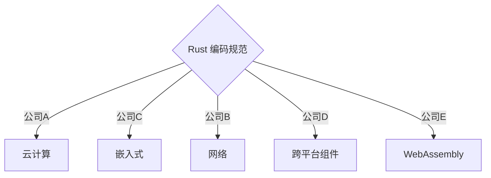

# Rust 编码规范介绍

据了解，Rust 社区内有些公司和组织都各自维护着自己的编码规范。下面罗列了一些已经公开的：

- [官方｜Rust API 编写指南](https://rust-lang.github.io/api-guidelines/about.html)
- [官方 | Rust Style Guide](https://github.com/rust-dev-tools/fmt-rfcs/blob/master/guide/guide.md)
- [法国国家信息安全局 | Rust 安全（Security）规范](https://anssi-fr.github.io/rust-guide)
- [Facebook Diem 项目 Rust 编码规范](https://developers.diem.com/docs/core/coding-guidelines/)
- [Apache Teaclave 安全计算平台 | Rust 开发规范](https://teaclave.apache.org/docs/rust-guildeline/)
- [PingCAP | 编码风格指南（包括 Rust 和 Go 等）](https://github.com/pingcap/style-guide)
- [Google Fuchsia 操作系统 Rust 开发指南](https://fuchsia.dev/fuchsia-src/development/languages/rust)
- [RustAnalyzer 编码风格指南](https://github.com/rust-analyzer/rust-analyzer/blob/master/docs/dev/style.md)

以上公开的编码规范，除官方Rust API 编写指南和法国国家信息安全局是通用目的公布之外，其他编码规范主要是为了开源项目自身统一贡献者编码风格而制作。

随着 Rust 的普及，各大公司应用 Rust 的需求增多，为了方便 Rust 在公司落地，需要一个统一的、通用的、可通过 Clippy 等工具辅助检查的编码规范。

本规范参考但不限于以上公开规范。本规范并非 Rust 教程，但也可以作为学习参考。

## 编码规范分类

1. 安全编码规范。
2. 领域最佳实践。
3. 工具链使用指南。
4. Rust优化指南。
5. 常用基础库指南。

## 贡献形式

本规范致力于成为统一的 Rust 编码规范，并联合国内外公司共同维护。

公司可以依赖本规范，结合自己的业务领域和团队习惯，形成自己的编码规范，并可以在日常实践中反哺本规范，让本规范更加完善。

个人开发者也可以参与贡献！

如何参与贡献？

请阅读 [贡献说明](./contribution.md) 。

